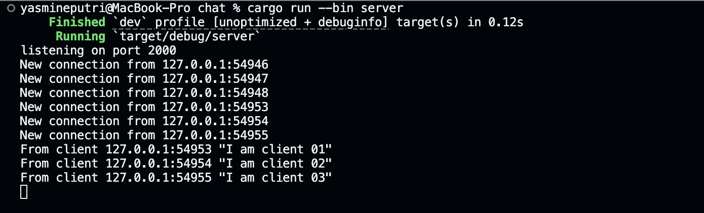
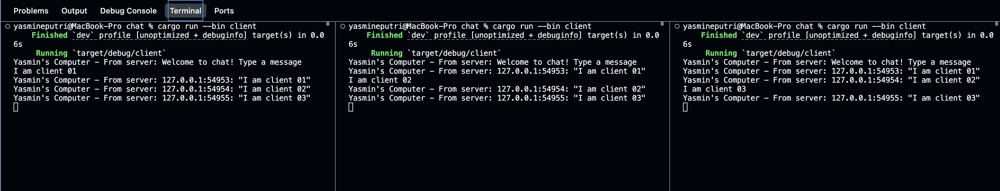
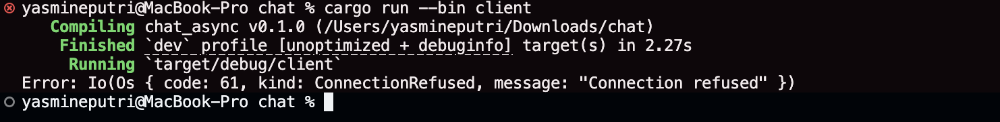
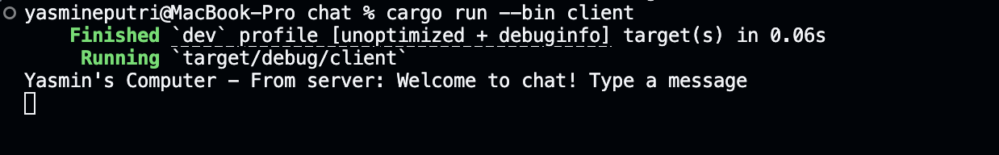

## Experiment 2.1

We can see in the first image that we have successfully started our chat server using Rust, which is now listening on port 2000 and actively accepting new connections from clients on the local machine (127.0.0.1) at different port numbers. Each time a client connects, the server logs the connection and, as clients send messages like "I am client 01", "I am client 02", and "I am client 03", the server receives and broadcasts these messages to all connected clients. In the second image, we observe three separate terminal windows, each running a client instance. Each client receives a welcome message from the server and then displays the broadcasted messages from all clients, including their own, showing that the chat system is working as intended. This demonstrates that our server is correctly handling multiple simultaneous client connections, receiving their messages, and broadcasting them to all participants in real time, allowing us to have a group chat experience.

## Experiment 2.2
### FAILED — Server Port 2000, Client Port 8080

This is failing because our client is trying to connect to ws://127.0.0.1:8080, but our server is actually running on port 2000. Since nothing is listening on port 8080, the connection is refused.

### SUCCESS — Match Server Port to be Port 8080

This is successful because our client is now able to connect to the server at the correct address and port (ws://127.0.0.1:2000). The server is running and accepting connections, so the client receives the welcome message, confirming that the connection and communication are working as expected.

## Experiment 2.3
We actually have included sender and receiver's IP addresses since the start of this repository. Both the server and client have included the sender and receiver’s IP addresses in their communication. On the server side, whenever a client sends a message, the server logs and broadcasts the message along with the client’s socket address (IP and port), as seen in the format {addr:?}: {text:?}. This means every message in the chat is tagged with the sender’s network address, making it clear who sent each message. On the client side, when messages are received from the server, they also display the sender’s address, so all participants can see which client sent each message. This approach helps identify users in the chat by their network address, even if they don’t have unique usernames.